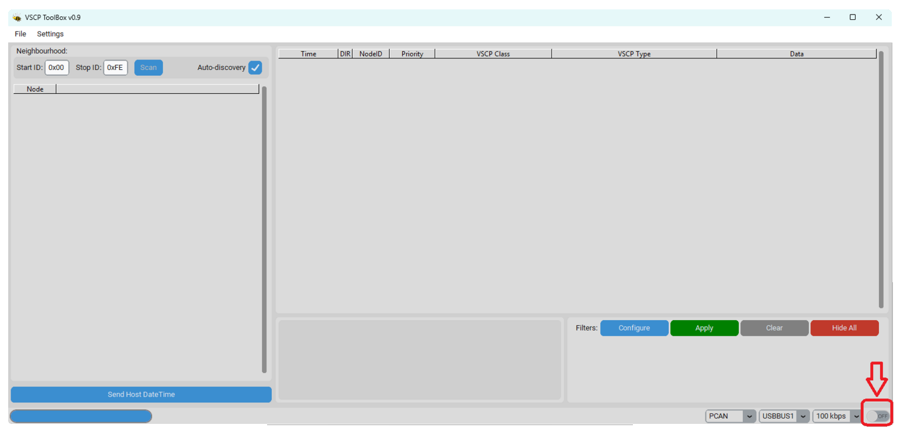
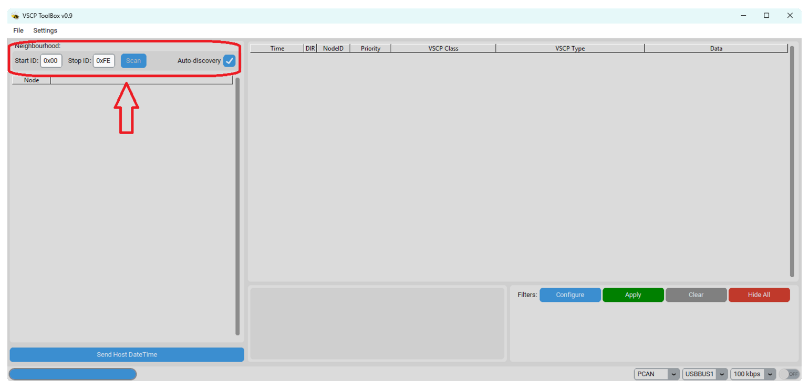
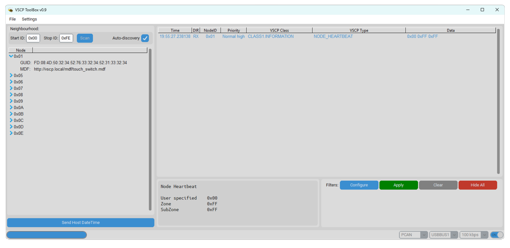
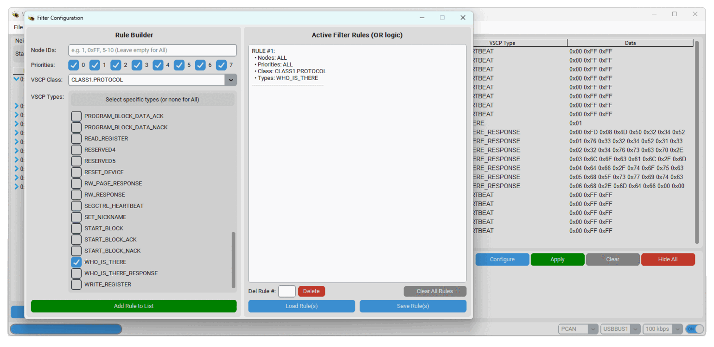
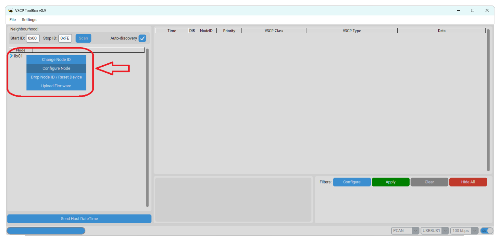
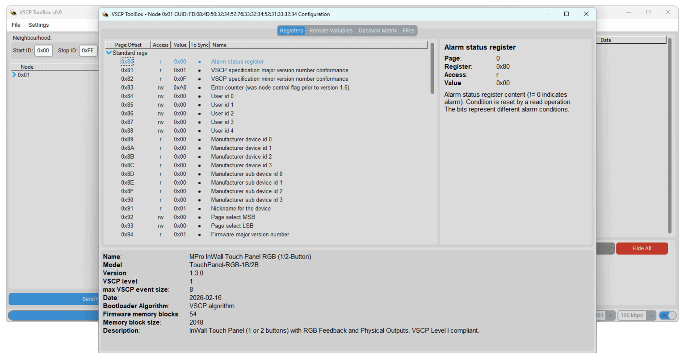
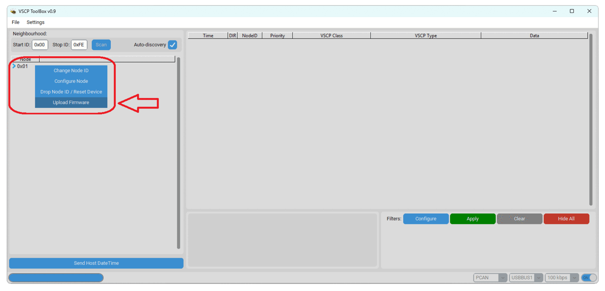
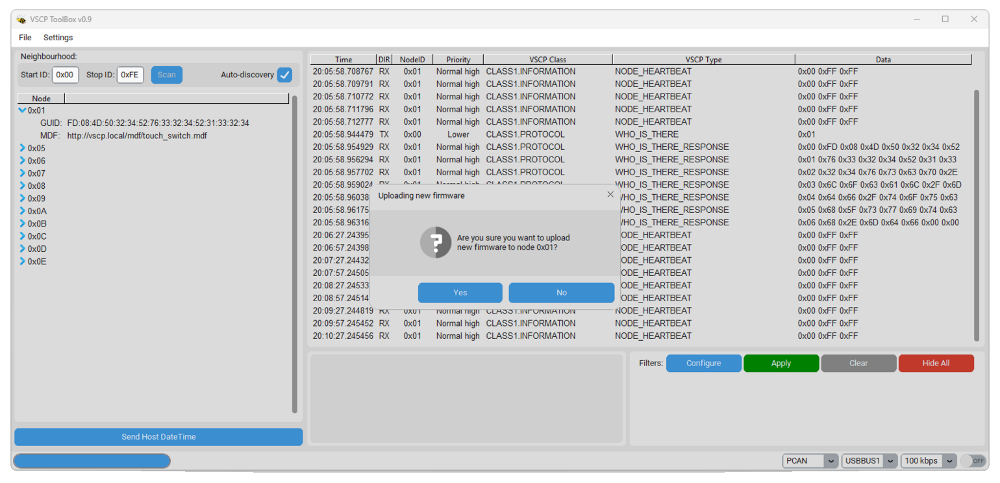
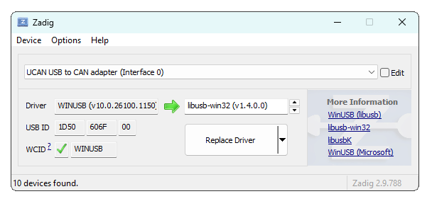

# **VSCP4CANToolBox**

**VSCP4CANToolBox** is a set of diagnostic and configuration tools designed for working with the [VSCP (Very Simple Control Protocol)](https://www.vscp.org/) [(Level I VSCP events)](https://grodansparadis.github.io/vscp-doc-spec/#/./vscp_level_i_specifics) on the CAN bus.

The application was created in **Python**, using the **CustomTkinter** library to build the user interface. This combination guarantees not only stability but also a modern, aesthetic appearance of the application. The interface is fully scalable and maintains visual consistency across all supported operating systems: Windows, Linux, and macOS.

## **Table of Contents**

- [**VSCP4CANToolBox**](#vscp4cantoolbox)
  - [**Table of Contents**](#table-of-contents)
  - [**Features**](#features)
  - [**Supported Hardware**](#supported-hardware)
  - [**gs\_usb Configuration (Windows)**](#gs_usb-configuration-windows)
  - [**Requirements**](#requirements)
  - [**Installation**](#installation)
    - [1. Cloning the Repository](#1-cloning-the-repository)
    - [2. Automatic Installation (Recommended)](#2-automatic-installation-recommended)
    - [3. Manual Installation (Alternative)](#3-manual-installation-alternative)
  - [**Running**](#running)
  - [**Quick Start**](#quick-start)
  - [**Troubleshooting**](#troubleshooting)
  - [**Contributing**](#contributing)
  - [**License**](#license)
  - [**Support**](#support)

## **Features**

The tool offers a range of functions essential for deploying VSCP-based automation systems:

* **Modern Interface:** Aesthetic and scalable User Interface (GUI) based on the CustomTkinter library, ensuring a modern look and consistency across different operating systems.

  <details>
  <summary>📷 View Application Appearance (click to expand)</summary>
  
  </details>

* **Node Discovery:** The module offers two modes for detecting devices on the network:
  * **Scan (Range):** Active scanning of a defined address range (from *Start ID* to *Stop ID*).
  * **Auto-discovery:** Passive mode running in the background. The application listens for events indicating a node's presence (Class: `PROTOCOL`; Type: `NEW_NODE_ONLINE` or Class: `INFORMATION`; Type: `NODE_HEARTBEAT`). Upon detecting activity, if the node is not yet on the list, it is queried (Class: `PROTOCOL`; Type: `WHO_IS_THERE`) and added to the found devices.

  <details>
  <summary>📷 View Scan Panel (click to expand)</summary>
  <br>
  
  </details>

* **VSCP/CAN Sniffer:** Real-time frame viewing with VSCP class and event type decoding.
  * **Filtering:** Advanced filtering options allow you to display only relevant messages. You can filter by Node ID, VSCP Class, Event Type, or Priority. This facilitates debugging in high-traffic networks.

  <details>
  <summary>📷 View Preview (click to expand)</summary>
  <br>
  
  </details>

  <details>
  <summary>📷 View Filter Options (click to expand)</summary>
  
  </details>

* **Register Configuration:** Read and write device configuration registers (compliant with VSCP specification).

  <details>
  <summary>📷 View Register Editor (click to expand)</summary>
  <br>
  
  </details>

* **Firmware Update:** Built-in tool for updating device firmware (Bootloader). Allows convenient uploading of new firmware versions in `*.bin` format directly via the CAN bus.

  <details>
  <summary>📷 View Update Panel (click to expand)</summary>
  <br>
  
  </details>

* **Local MDF Server (HTTP):** The application runs a local HTTP server in the background, enabling offline handling of [MDF (Module Description File)](https://grodansparadis.github.io/vscp-doc-spec/#/./vscp_module_description_file) files.
  * If a device reports a configuration file in the `vscp.local` domain (e.g., `http://vscp.local/device_module.mdf`), the program automatically looks for this file in the local `mdf` directory (located in the application folder).
  * This solution allows for full device configuration without external internet access – simply place the appropriate `.mdf` files (containing XML or JSON structure) in the `mdf` folder.

* 🚧 **Event Sending (Coming Soon):** *Feature currently under implementation. In the future, it will allow manual generation and sending of VSCP events to the bus.*

## **Supported Hardware**

VSCP4CANToolBox uses system libraries and `python-can`, officially supporting the following interfaces:

* **Peak-System (PCAN):** Full support for PCAN-USB adapters.
* **SocketCAN (Linux):** Native support on Linux systems.
* **gs_usb (Windows):** Support for devices (e.g., CandleLight, CANable, UCAN) using the `gs_usb` driver.
* **slcan:** Support for adapters operating in serial mode (e.g., USBtin, CANable in slcan mode).

## **gs_usb Configuration (Windows)**

To use `gs_usb` type adapters (e.g., CandleLight, UCAN) on Windows, it is necessary to install the **libusb-win32** driver using the Zadig tool. Without this step, Windows will not recognize the device correctly for the `python-can` library.

1. Download [Zadig](https://zadig.akeo.ie/).
2. Connect the CAN adapter to the USB port.
3. Run Zadig.
4. From the menu, select `Options` -> `List All Devices`.
5. Select your device from the list (e.g., "UCAN USB to CAN adapter").
6. In the target driver field (to the right of the green arrow), select **libusb-win32**.
7. Click the **Replace Driver** (or *Install Driver*) button.

> 
> <br>    *Changing driver to libusb-win32 for gs_usb support on Windows.*

## **Requirements**

To run the software, you need:

* **Python 3.10** or newer.
* Operating system: Windows, Linux, or macOS.

## **Installation**

### 1. Cloning the Repository

Download the source code to your computer:

```bash
git clone https://github.com/michpro/VSCP4CANToolBox.git
cd VSCP4CANToolBox
```

### 2. Automatic Installation (Recommended)

The project includes scripts that automatically create a virtual environment (`.venv`) and install the required dependencies from `requirements.txt`.

**Windows:**
Run the `install.bat` file (double-click or via command line).
```cmd
install.bat
```

**Linux / macOS:**
Grant execution permissions and run the `install.sh` script.
```bash
chmod +x install.sh
./install.sh
```

### 3. Manual Installation (Alternative)

If the automatic scripts do not work in your environment, follow these steps:

1. Create a virtual environment:
   ```bash
   python -m venv .venv
   ```
2. Activate the environment:
   * Windows: `.\.venv\Scripts\activate`
   * Linux: `source .venv/bin/activate`
3. Install dependencies:
   ```bash
   pip install -r requirements.txt
   ```

## **Running**

To run the application, use the dedicated startup scripts which automatically use the configured virtual environment.

**Windows:**
Run the `VSCP4CANToolBox.bat` file.

**Linux / macOS:**
Run the `VSCP4CANToolBox.sh` script.
```bash
./VSCP4CANToolBox.sh
```

## **Quick Start**

1. Connect the CAN adapter to your computer.
2. Launch the application using the startup script.
3. In the settings, select the interface type (e.g., `socketcan` or `slcan`) and channel (e.g., `can0` or `COM3`).
4. Click **Connect**.
5. You should see frames flowing in the main window.

## **Troubleshooting**

**`ModuleNotFoundError` despite installation**
* Ensure you are running the program via the `VSCP4CANToolBox.bat/sh` scripts, which utilize the correct `.venv` virtual environment.

**Display issues (DPI scaling)**
* CustomTkinter usually handles scaling well, but if the window appears blurry on Windows, check the DPI settings in the properties of the `python.exe` file or set scaling in the code: `customtkinter.set_widget_scaling(1.0)`.

**No access to CAN device (Linux)**
* Ensure the interface is up: `sudo ip link set up can0 type can bitrate 125000`.

## **Contributing**

We welcome bug reports and feature suggestions (Pull Requests).

## **License**

Copyright © 2024-2026 Michal Protasowicki

This project is licensed under the MIT License.

[](LICENSE)

---
Author: [Michał Protasowicki](https://github.com/michpro)

VSCP Homepage: [https://www.vscp.org](https://www.vscp.org)

## **Support**
If You find my projects interesting and You wanted to support my work, You can give me a cup of coffee or a keg of beer :) ... or at least give this project a star ⭐

[](https://www.paypal.me/michpro)&nbsp;&nbsp;&nbsp;&nbsp;&nbsp;[](https://ko-fi.com/F1F24CEW1)&nbsp;&nbsp;&nbsp;&nbsp;&nbsp;[](https://commerce.coinbase.com/checkout/ec299320-cbed-475d-976e-fdf37c1ac3d0)
