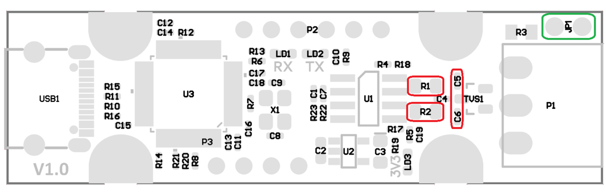

# FYSETC UCAN - Cheap and Reliable USB-CAN Adapter

**FYSETC UCAN** is a CAN adapter based on the STM32F072 microcontroller. It is an Open Source Hardware solution that serves as an excellent and affordable alternative to expensive commercial adapters.

However, for the device to work stably and reliably, it requires a minor hardware modification and the installation of appropriate firmware.

Project link: <https://github.com/FYSETC/UCAN>

## 1. Hardware Modification (Hardware Mod)

The factory configuration of the board contains redundant components on the CAN bus lines, which can negatively affect transmission parameters and circuit impedance.

### Required Changes:

1. **Removing Components (R1, R2, C5, C6):**
   You need to desolder (remove) the following components marked in red in the image below:

   

   * **R1, R2** – These are **terminating/biasing resistors**.
     **Why remove them?** If you connect the adapter to an existing CAN bus that is correctly terminated at the ends (standard 120 Ohm at each end), extra resistors in the adapter (which is often connected "in the middle" of the bus) disturb the network impedance. This can lead to resistance dropping below acceptable levels and transmission errors.

   * **C5, C6** – These are **EMC filtering capacitors** (between CAN lines and ground).
     **Theory:** These components act as a low-pass filter intended to short high-frequency interference to ground and improve electromagnetic compatibility.
     **Problem in UCAN:** The capacitance used is too high for fast transmissions (e.g., 1 Mbit/s). Instead of filtering only noise, these capacitors cause the signal edges to rise too slowly ("rounding" the square wave). The standard for 1 Mbit/s requires a node capacitance of <35 pF, and in this case, it is exceeded, preventing proper communication. Removing them restores sharp signal edges.

2. **Installing Termination Jumper (JP1):**
   Solder pin headers into the spot marked as **JP1** (marked in green).

   * **Function:** This jumper is used to enable the built-in **120 Ohm** terminating resistor.

   * **Principle of Operation:**

     * **Jumper installed:** Termination active (use if UCAN is the first or last device on the bus).

     * **Jumper removed:** No termination (use if UCAN is connected between other devices).

> **Note:** Please refer to the schematic diagram available here: [UCAN V1.0 SCH.pdf](https://github.com/FYSETC/UCAN/blob/main/Hardware/UCAN%20V1.0%20SCH.pdf)

## 2. Firmware Selection and Installation

The board is compatible with several popular firmwares. Below is a list of the best solutions.

### Option 1: candleLight (Recommended)

The most stable and modern firmware. It supports the native **Linux SocketCAN standard** (device visible as a network interface, e.g., `can0`), and on **Windows**, it works using the `gs_usb` driver.

* **Repository:** <https://github.com/candle-usb/candleLight_fw>

* **How to download:**

  1. Go to the *Actions* tab (or click the CI status).

  2. Select the latest workflow run on the `master` branch that completed successfully (marked with a green checkmark).

  3. At the bottom of the page, in the *Artifacts* section, download the firmware package.

  4. Look for the file: `FYSETC_UCAN_fw.bin`.

### Option 2: PCAN Firmware (Good Alternative)

Firmware emulating popular PEAK-System adapters. Very useful if you work on Windows and need compatibility with PCAN-View tools.

* **Repository:** [https://github.com/SummerFalls/pcan_cantact](https://github.com/SummerFalls/pcan_cantact)

* **Downloading:** Go to [Releases v1.6.5](https://github.com/SummerFalls/pcan_cantact/releases/tag/v1.6.5).

* **Correct file:** Download and flash the file `pcan_cantact_8_hw.bin`.

### Option 3: slcan (Not Recommended)

An older serial protocol. This option is **least recommended** due to lower performance and the need to modify the source code before compilation.

* **Repository:** <https://github.com/normaldotcom/canable-fw>

* **Required modifications:**
  To make this firmware work on UCAN, you need to compile the code yourself, introducing changes:

  1. Change the processor definition from `STM32F042` to `STM32F072`.

  2. Change the pin assignment for LEDs (TX and RX), because UCAN has them connected differently than the original Canable.

### Flashing Instructions (DFU)

To flash the firmware, the STM32 processor must be started in DFU (Device Firmware Upgrade) mode.

**Step 1: Enter DFU Mode**

1. Disconnect UCAN from the computer.

2. Locate the pins labeled **B0** (BOOT0) and **3V3** on the edge of the board.

3. Bridge pin **B0** with pin **3V3** (e.g., using a jumper wire).

4. While holding the bridge, connect UCAN to USB.

**Step 2: Flash the File (Choose one method)**

#### Method A: Browser (Easiest)

Requires a Chromium-based browser (Chrome, Edge, Brave, Opera).

1. Open the page: <https://devanlai.github.io/webdfu/dfu-util/>

2. Click the **Connect** button.

3. In the popup window, select the device "STM32 BOOTLOADER" and click "Connect".

4. In the "Firmware Download" section, select the previously downloaded `.bin` file.

5. Click **Download**. Upon completion, the progress bar will fill with green.

#### Method B: Native Programs

If you prefer using dedicated applications:

* **Linux/Mac:** Install and use the `dfu-util` tool from the command line.

* **Windows:** Use the `STM32CubeProgrammer` software.

**Step 3: Completion**

1. Disconnect power (USB).

2. Remove the bridge between B0 and 3V3.

3. Upon reconnection, the device will start with the new firmware.
